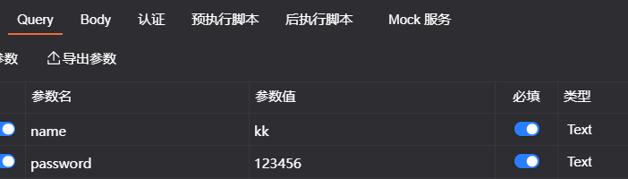
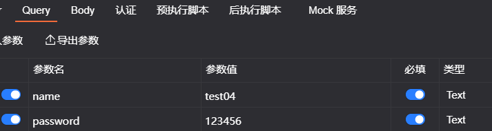
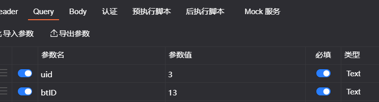
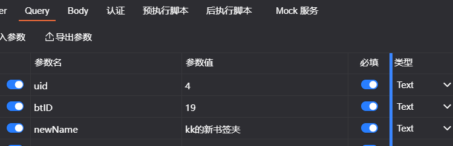
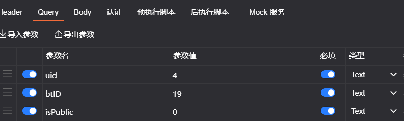
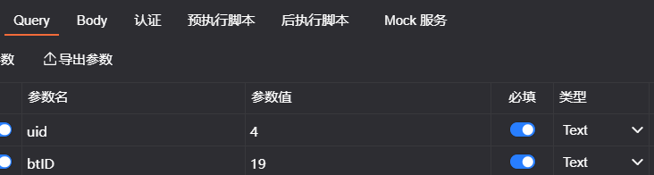
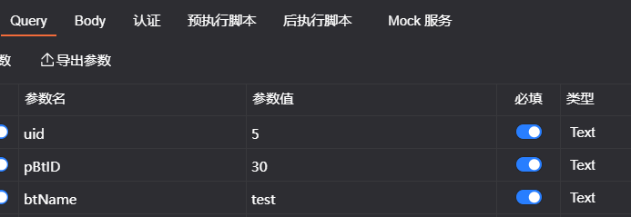
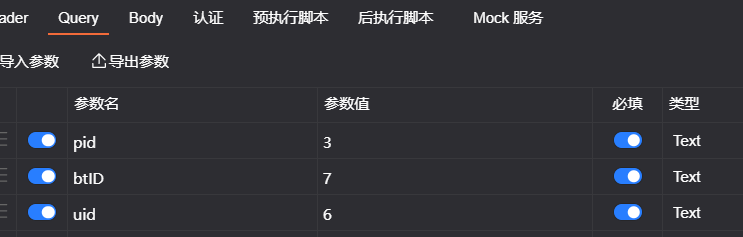
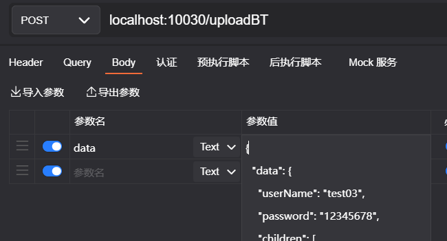

# Bookmark后端接口


- [注册登录接口](#注册登录)
- [前端书签树操作](#前端书签树操作)
- [插件端书签树操作](#插件端书签树操作)
- [部署](#部署)


[测试数据](./bookmark.sql)

## 注册登录

```java
// url:47.96.41.120:10030/login?name=kk&password=123456
    @GetMapping(value = "/login")
    public @ResponseBody Object login(@RequestParam HashMap<String, String> data)
```




```java
// url:47.96.41.120:10030/login?name=test03&password=123456
    @GetMapping(value = "/register")
    public @ResponseBody Object register(@RequestParam HashMap<String, String> data)
```




## 前端书签树操作

```java
/**
     * Description: 获取某个书签夹下的内容（书签夹和书签），向下一层
     * @param data:  url = 47.96.41.120:10030/nextLayer?uid= &btID=
     * @return:  Map<String, String> response:
     *           k-v:  "msg"       :  操作成功 / 操作失败
     *                 "errorCode" :  1 / -1
     *                 "httpCode"  :  200
     *                 "data"      :  json格式的书签树字符串(操作成功才有该属性)
     */
    @GetMapping("/nextLayer")
    public @ResponseBody Object getBtNextLayer(@RequestParam HashMap<String, String> data)
```




```java
/**
      * Description: 重命名书签(夹)
      * @param data: url = 47.96.41.120:10030/renameBT?uid= &btID= &newName=
      * @return:  Map<String, String> response:
      *           k-v:  "msg"       :  操作成功 / 书签(夹)不存在 / 操作失败
      *                 "errorCode" :  1 / -1 / -2
      *                 "httpCode"  :  200
      */
    @GetMapping("/renameBT")
    public @ResponseBody Object renameBT(@RequestParam HashMap<String, String> data)
```




```java
/**
      * Description: 公开或私密 某个书签夹(其子书签夹也一致)
      * @param data: url = 47.96.41.120:10030/publicBTOrNot?uid= &btID= &isPublic= (0:私密；1:公开)
      * @return:  Map<String, String> response:
      *           k-v:  "msg"       :  操作成功 / 权限不够 / 操作失败
      *                 "errorCode" :  1 / -1 / -2
      *                 "httpCode"  :  200
      */
    @GetMapping("/publicBTOrNot")
    public @ResponseBody Object publicBTOrNot(@RequestParam HashMap<String, String> data)
```




```java
/**
     * Description:  删除某个书签夹(其子书签(夹)也一致)
     * @param data: url = 47.96.41.120:10030/deleteBT?uid= &btID= 
     * @return:  Map<String, String> response:
     *           k-v:  "msg"       :  操作成功 / 权限不够 / 操作失败
     *                 "errorCode" :  1 / -1 / -2
     *                 "httpCode"  :  200
     */
    @GetMapping("/deleteBT")
    public @ResponseBody Object deleteBT(@RequestParam HashMap<String, String> data)
```




```java
/**
     * Description:  在某个父书签夹下创建书签夹
     * @param data: url = 47.96.41.120:10030/createBT?uid= &pBtID= (父书签夹ID)&btName=
     * @return:  Map<String, String> response:
     *           k-v:  "msg"       :  操作成功 / 操作失败
     *                 "errorCode" :  1 / -1
     *                 "httpCode"  :  200
     */
    @GetMapping("/createBT")
    public @ResponseBody Object createBT(@RequestParam HashMap<String, String> data)
```




```java
/**
     * Description:  复制某个书签夹(pid所属用户id, btID, 其子书签(夹)也一致)到当前用户(uid)根书签夹下
     * @param data: url = 47.96.41.120:10030/pid= &btID= &uid= 
     * @return:  Map<String, String> response:
     *           k-v:  "msg"       :  操作成功 / 权限不够 / 操作失败
     *                 "errorCode" :  1 / -1 / -2
     *                 "httpCode"  :  200
     */
    @GetMapping("/copyBT")
    public @ResponseBody Object copyBT(@RequestParam HashMap<String, String> data)
```




## 插件端书签树操作

```java
/**
     * Description:  上传书签树
     * @param data:  json 格式书签树
     * @return:  Map<String, String> response:
     *           k-v:  "msg"       :  操作成功 / 操作失败
     *                 "errorCode" :  1 / -1
     *                 "httpCode"  :  200
     *                 "data"      :  上传时间(操作成功才有该属性)
     */
    @PostMapping("/uploadBT")
    public @ResponseBody Object uploadBT(String data)
```




```java
/**
     * Description: 获取当前用户所有的书签夹信息
     * @param uid:  当前用户
     * @return:  Map<String, String> response:
     *           k-v:  "msg"       :  操作成功 / 操作失败
     *                 "errorCode" :  1 / -1
     *                 "httpCode"  :  200
     *                 "data"      :  json格式的书签树字符串(操作成功才有该属性)
     */
    @GetMapping("/obtainBT/{uid}")
    public @ResponseBody Object obtainBT(@PathVariable("uid") Integer uid)
```


- 注：obtainBT返回的是字符串，后端可以用`JSONObject jsonObject = JSON.parseObject(res);`转为json对象，前端应该也有相应的方法。


## 部署

```bash
lsof -i:10030     # 查看进程的PID
kill -s 9 {PID}   # 强制停止对应的进程

cd /www/server/tomcat/webapps
# 后台一直运行并把日志输入到log.out
nohup java -jar bookmark-0.0.1-SNAPSHOT.jar &
```

